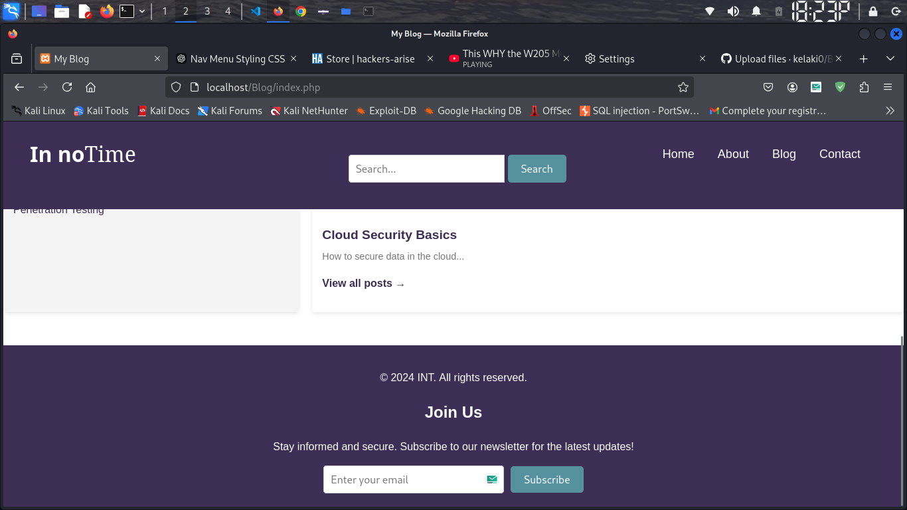
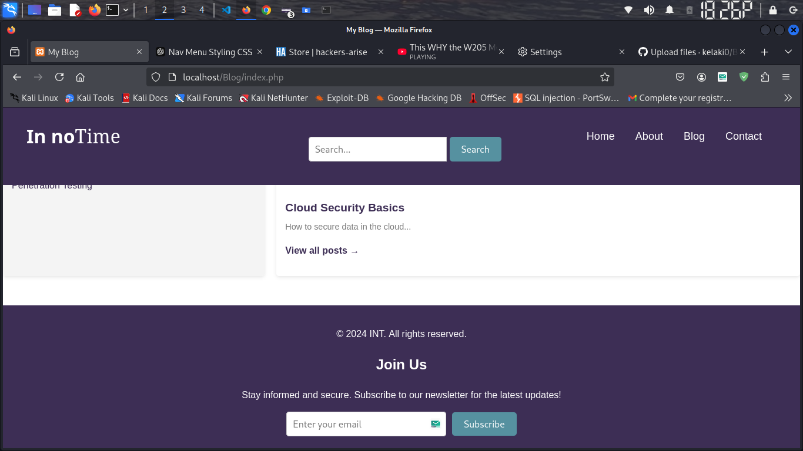

# Blog

project/
├── admin/                 # Admin section
│   ├── admin_login.php    # Admin login page
│   ├── index.php          # Admin dashboard
│   ├── add_post.php       # Add new posts
│   ├── edit_post.php      # Edit posts
│   ├── manage_posts.php   # View/manage posts
│   ├── manage_comments.php # Moderate comments
│   ├── logout.php         # Admin logout
│   └── styles.css         # Admin-specific styles
├── includes/
│   └── db.php             # Database connection
├── posts/
│   └── (Blog posts storage, if needed)
├── public/                # Main blog section
│   ├── index.php          # Homepage
│   ├── post.php           # View single post
│   └── styles.css         # Blog-specific styles
└── uploads/               # For storing uploaded images

30/11/2024
* Confirm Password
1. Retrieve form data. The PHP script retrieves the password and confirm-password from the submitted form
2. Valdate Password Confrirm. It compares the two values, if they do not macth, an error message is       displayed and the user is redirected to the register page.
3. Rest of registration logic. If the passwords match, the script continues with the rest of the registration process such as hashing the password, inserting the user into the database and sending a confirmation email.

* Password reset
* Confirmation email