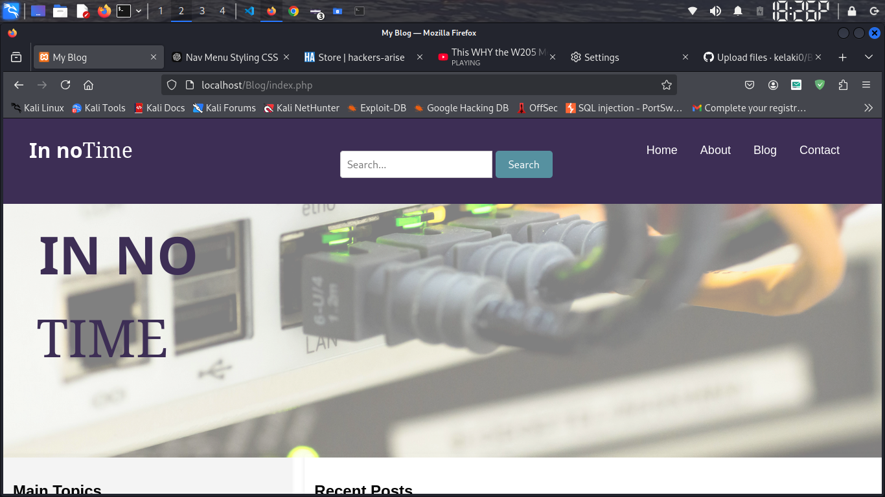

# Blog

In No Time - Blog Website

Welcome to In No Time, a professional blog platform focused on penetration testing and cybersecurity. This project is built from scratch using core web development technologies, providing a hands-on experience in both frontend and backend development.
Primary Functionalities
1. Blog Management

    Post Creation:
    Super Admins and Admins can create, edit, and delete blog posts.
    Each post supports rich text, code snippets, and media uploads.

    Categorization:
       Blog posts are categorized into 
        1. Tools
        2. Tutorials
        3. Case Studies
        4. Career Tips for easy navigation.

       Search Functionality:
        Readers can search posts using keywords or tags.

2. User Authentication

    Roles and Permissions:
        Super Admin: Full control over the website (user management, content, settings).
        Admin: Can manage content and moderate comments but has restricted access to critical settings.
        Readers: Can view posts and leave comments.

    Secure Authentication:
        User passwords are securely hashed using bcrypt.
        Role-based access control to restrict sensitive actions.

3. Interactive Features

    Commenting System:
        Readers can comment on posts.
        Admins can moderate and delete inappropriate comments.

    Dynamic Pages:
    Content like blog posts and resources is dynamically loaded from the database.

4. Resources Page

    Tool Listings:
    A curated list of penetration testing tools with descriptions and download links.

    Downloads:
    E-books, scripts, and other resources are available for readers.

5. Responsive Design

    Fully responsive layout optimized for both desktop and mobile devices using CSS3 and Bootstrap.

Technology Stack
Frontend:

    HTML5 & CSS3: Structure and styling.
    JavaScript: Interactivity and AJAX-based functionalities.
    Bootstrap: For responsive and modern UI components.

Backend:

    PHP: Server-side scripting.
    MySQL: Relational database for storing users, posts, comments, and resources.

Development Tools:

    XAMPP: Local development environment.
    Git & GitHub: Source control and version management.

Setup Instructions
1. Prerequisites

    Install XAMPP for a local server environment.
    Install Git for version control.
    Basic knowledge of HTML, CSS, JavaScript, and PHP is required.

2. Installation

    Clone the repository:

git clone https://github.com/kelaki0/Blog.git

Start XAMPP and enable Apache and MySQL.

Copy the project folder to the htdocs directory in XAMPP.

Import the database:

    Open phpMyAdmin.
    Create a new database named intime_blog.
    Import the SQL file located in /database/intime.sql.

Configure the database connection:

    Open config.php and update the following:

        $db_host = 'localhost';
        $db_name = 'int_db';
        $db_user = 'root';
        $db_pass = ''; // Update if your MySQL has a password

    Open the project in your browser:
        Navigate to http://localhost/blog.

Development Workflow

    Branching Strategy:
        Use GitHub to manage branches for different features (feature/authentication, feature/ui-improvements, etc.).
        Commit regularly and push changes.

    Testing:
        Test locally for functionality, responsiveness, and security vulnerabilities.
        Use phpMyAdmin for database queries testing.

    Deployment:
        Use tools like FileZilla or SSH to deploy on a hosting provider.

Future Features

    REST API: Expose APIs for external integrations or mobile app development.
    Analytics Dashboard: Provide metrics like post views and user activity.
    Dark Mode: Add a toggle for better accessibility.
    Gamified Learning: Introduce CTF challenges for readers.
    Password reset: Users password reset.

Contributing

Contributions are welcome! If you would like to contribute:

    Fork the repository.
    Create a new branch for your feature:

git checkout -b feature/your-feature

Commit your changes and push:

    git commit -m "Add your feature"
    git push origin feature/your-feature

    Submit a pull request for review.

License

This project is licensed under the MIT License. Feel free to use and modify it for your personal or professional needs.
Contact

For inquiries, feedback, or collaboration:

    Email: kipngenol422@gmail.com
    GitHub: kelaki0
    Twitter: @Admiral_kev

